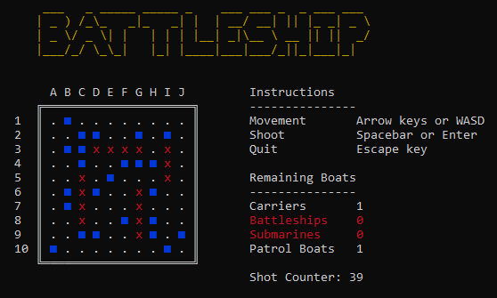

<div align="center">
    
</div>

## Installation & Usage
Portable executables can be found in the [releases](https://github.com/reflectd/Battleship-TUI/releases).
### Docker Container
1. Install [Docker](https://docs.docker.com/engine/install/)
2. Clone the repository
    ```
    git clone https://
    cd battlship
    ```
3. Build the image
    ```
    docker build -t battleship .
    ```
4. Run the container
    ```
    docker run --name battleship -it battleship
    ```
> [!TIP]  
> To start the container again after it's been stopped, run `docker start -ai battleship`.
### Manual Build
1. Install the [.NET 9.0 SDK](https://dotnet.microsoft.com/en-us/download/dotnet/9.0)
2. Clone the repository
    ```
    git clone https://github.com/reflectd/Battleship-TUI
    cd battlship/src
    ```
3. Publish the app
    ```
    dotnet publish -c Release -o .
    ```
> [!NOTE]  
> This creates a **framework-dependant** executable, meaning you need the .NET runtime in order to run it (included when installing the .NET SDK).  
> * To create a portable executable (i.e. with runtime included), add the `-p:SelfContained=true` flag.  
> * To compile ahead-of-time (AOT) to reduce the binary size, add the `-p:PublishAot=true` flag (you may need to install a compilation toolchain to achieve this).
4. Run the binary
    ```
    ./Battleship
    ```
    